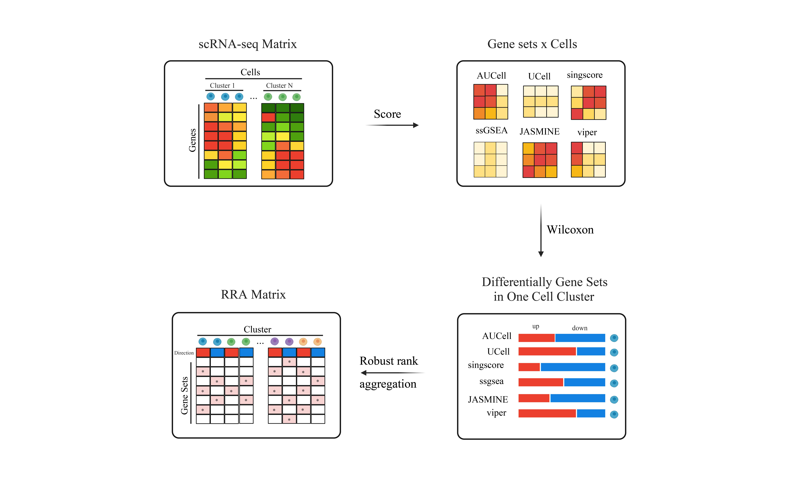

<!-- README.md is generated from README.Rmd. Please edit that file -->

```{r, include = FALSE}
knitr::opts_chunk$set(
  collapse = TRUE,
  comment = "#>",
  fig.path = "man/figures/README-",
  out.width = "100%"
)
```

# irGSEA

<!-- badges: start -->

<!-- badges: end -->

Integrate all single cell rank-based gene set enrichment analysis and
easy to visualize the results.

For more details, please view [irGSEA](https://chuiqin.github.io/irGSEA/)
And you can view:
[Chinese tutorial_1](https://www.jianshu.com/p/463dd6e2986f)
[Chinese tutorial_2](https://www.jianshu.com/p/66c365352613)


# 0.Graph Abstrast



# 1.Installation

```{r, eval = FALSE}

# install packages from CRAN
cran.packages <- c("aplot", "BiocManager", "circlize", "cowplot","data.table", 
                   "devtools", "doParallel", "doRNG", "dplyr", "ggfun", "gghalves", 
                   "ggplot2", "ggplotify", "ggridges", "ggsci", "irlba",
                   "magrittr", "Matrix", "msigdbr", "pagoda2", "plyr", "pointr", 
                   "purrr", "RcppML", "readr", "reshape2", "reticulate", 
                   "rlang", "RMTstat", "RobustRankAggreg", "roxygen2", 
                   "Seurat", "SeuratObject", "stringr", "tibble", "tidyr", 
                   "tidyselect", "tidytree", "VAM")

for (i in cran.packages) {
  if (!requireNamespace(i, quietly = TRUE)) {
    install.packages(i, ask = F, update = F)
  }
}

# install packages from Bioconductor
bioconductor.packages <- c("AUCell", "BiocParallel", "ComplexHeatmap", 
                           "decoupleR", "fgsea", "ggtree", "GSEABase", 
                           "GSVA", "Nebulosa", "scde", "singscore",
                           "SummarizedExperiment", "UCell",
                           "viper","sparseMatrixStats")

for (i in bioconductor.packages) {
  if (!requireNamespace(i, quietly = TRUE)) {
    BiocManager::install(i, ask = F, update = F)
  }
}

# install packages from Github
if (!requireNamespace("irGSEA", quietly = TRUE)) { 
    devtools::install_github("chuiqin/irGSEA", force =T)
}

```

Optional installation if you want to perform VISION, gficf, Sargent, ssGSEApy, GSVApy, etc
```{r, eval = FALSE}

#### install packages from Github
# VISION
if (!requireNamespace("VISION", quietly = TRUE)) { 
    devtools::install_github("YosefLab/VISION", force =T)
}

# mdt need ranger
if (!requireNamespace("ranger", quietly = TRUE)) { 
  devtools::install_github("imbs-hl/ranger", force =T)
}

# gficf need RcppML (version > 0.3.7) package
if (!utils::packageVersion("RcppML") > "0.3.7") {
  message("The version of RcppML should greater than 0.3.7 and install RcppML package from Github")
  devtools::install_github("zdebruine/RcppML", force =T)
}

# please first `library(RcppML)` if you want to perform gficf
if (!requireNamespace("gficf", quietly = TRUE)) { 
    devtools::install_github("gambalab/gficf", force =T)
}

# GSVApy and ssGSEApy need SeuratDisk package
if (!requireNamespace("SeuratDisk", quietly = TRUE)) { 
    devtools::install_github("mojaveazure/seurat-disk", force =T)
}

# sargent
if (!requireNamespace("sargent", quietly = TRUE)) { 
    devtools::install_github("Sanofi-Public/PMCB-Sargent", force =T)
}

# pagoda2 need scde package
if (!requireNamespace("scde", quietly = TRUE)) { 
  devtools::install_github("hms-dbmi/scde", force =T)
}

# if error1 (functio 'sexp_as_cholmod_sparse' not provided by package 'Matrix')
# or error2 (functio 'as_cholmod_sparse' not provided by package 'Matrix') occurs
# when you perform pagoda2, please check the version of irlba and Matrix
# It's ok when I test as follow：
# R 4.2.2 irlba(v 2.3.5.1) Matrix(1.5-3)
# R 4.3.1 irlba(v 2.3.5.1) Matrix(1.6-1.1)
# R 4.3.2 irlba(v 2.3.5.1) Matrix(1.6-3)


#### create conda env
# If error (Unable to find conda binary. Is Anaconda installed) occurs, 
# please perform `reticulate::install_miniconda()`
if (! "irGSEA" %in% reticulate::conda_list()$name) {
      reticulate::conda_create("irGSEA")
}

# if python package exist
python.package <- reticulate::py_list_packages(envname = "irGSEA")$package
require.package <- c("anndata", "scanpy", "argparse", "gseapy", "decoupler")
for (i in seq_along(require.package)) {
  if (i %in% python.package) {
    reticulate::conda_install(envname = "irGSEA", packages = i, pip = T)
  }
}


```

Some users can accelerate by mirror

```{r, eval = FALSE}
options(BioC_mirror="https://mirrors.tuna.tsinghua.edu.cn/bioconductor/")
options("repos" = c(CRAN="http://mirrors.cloud.tencent.com/CRAN/"))

# install packages from CRAN
cran.packages <- c("aplot", "BiocManager", "circlize", "cowplot", "data.table",
                   "devtools", "doParallel", "doRNG", "dplyr", "ggfun", "gghalves", 
                   "ggplot2", "ggplotify", "ggridges", "ggsci", "irlba",
                   "magrittr", "Matrix", "msigdbr", "pagoda2", "plyr", "pointr", 
                   "purrr", "RcppML", "readr", "reshape2", "reticulate", 
                   "rlang", "RMTstat", "RobustRankAggreg", "roxygen2", 
                   "Seurat", "SeuratObject", "stringr", "tibble", "tidyr", 
                   "tidyselect", "tidytree", "VAM")

for (i in cran.packages) {
  if (!requireNamespace(i, quietly = TRUE)) {
    install.packages(i, ask = F, update = F)
  }
}

# install packages from Bioconductor
bioconductor.packages <- c("AUCell", "BiocParallel", "ComplexHeatmap", 
                           "decoupleR", "fgsea", "ggtree", "GSEABase", 
                           "GSVA", "Nebulosa", "scde", "singscore",
                           "SummarizedExperiment", "UCell", "viper")

for (i in bioconductor.packages) {
  if (!requireNamespace(i, quietly = TRUE)) {
    BiocManager::install(i, ask = F, update = F)
  }
}

# install packages from git
if (!requireNamespace("irGSEA", quietly = TRUE)) { 
    devtools::install_git("https://gitee.com/fan_chuiqin/irGSEA.git", force =T)
}
# VISION
if (!requireNamespace("VISION", quietly = TRUE)) { 
    devtools::install_git("https://gitee.com/fan_chuiqin/VISION.git", force =T)
}

# mdt need ranger
if (!requireNamespace("ranger", quietly = TRUE)) { 
  devtools::install_git("https://gitee.com/fan_chuiqin/ranger.git", force =T)
}

# gficf need RcppML (version > 0.3.7) package
if (!utils::packageVersion("RcppML") > "0.3.7") {
  message("The version of RcppML should greater than 0.3.7 and install RcppML package from Git")
  devtools::install_git("https://gitee.com/fan_chuiqin/RcppML.git", force =T)
}

# please first `library(RcppML)` if you want to perform gficf
if (!requireNamespace("gficf", quietly = TRUE)) { 
    devtools::install_git("https://gitee.com/fan_chuiqin/gficf.git", force =T)
}

# GSVApy and ssGSEApy need SeuratDisk package
if (!requireNamespace("SeuratDisk", quietly = TRUE)) { 
    devtools::install_git("https://gitee.com/fan_chuiqin/seurat-disk.git", 
                          force =T)}

# sargent
if (!requireNamespace("sargent", quietly = TRUE)) { 
    devtools::install_git("https://gitee.com/fan_chuiqin/PMCB-Sargent.git", 
                          force =T)}

# pagoda2 need scde package
if (!requireNamespace("scde", quietly = TRUE)) { 
  devtools::install_git("https://gitee.com/fan_chuiqin/scde.git", force =T)
}

#### create conda env
# If error (Unable to find conda binary. Is Anaconda installed) occurs, 
# please perform `reticulate::install_miniconda()`
if (! "irGSEA" %in% reticulate::conda_list()$name) {
      reticulate::conda_create("irGSEA")
}

# if python package exist
python.package <- reticulate::py_list_packages(envname = "irGSEA")$package
require.package <- c("anndata", "scanpy", "argparse", "gseapy", "decoupler")
for (i in require.package) {
  if (! i %in% python.package) {
    reticulate::conda_install(envname = "irGSEA", packages = i, pip = T,
     pip_options = "-i https://pypi.tuna.tsinghua.edu.cn/simple")
  }
}

```

# 2.Available method
The time and peak memory consumption associated with 50 Hallmark gene sets 
across 19 scoring methods for datasets of varying sizes.To address memory 
peak issues for datasets exceeding 50,000 cells, we implemented a strategy 
of partitioning them into processing units of 5,000 cells each for scoring. 
While this strategy mitigates memory peak issues, it extends the processing time.


The time and peak memory consumption associated with 50 Hallmark gene sets 
across irGSEA (AUCell, UCell, singscore, ssgsea, JASMINE and viper) for 
datasets of varying sizes while the parameter chunk works.


# 3.Example dataset

## pre-processing workflow

Start from the 10X output file and organize it into the format required 
by the irGSEA package

``` {r, eval = FALSE}
# load library
library(dplyr)
library(Seurat)
# download the pbmc3k.final dataset
# the dataset is the output of the Cell Ranger pipeline from 10X
# decompress the file to the specified directory
download.file("https://cf.10xgenomics.com/samples/cell/pbmc3k.final3k/pbmc3k.final3k_filtered_gene_bc_matrices.tar.gz",
              destfile = "./pbmc3k.final3k_filtered_gene_bc_matrices.tar.gz")
untar("./pbmc3k.final3k_filtered_gene_bc_matrices.tar.gz", exdir = "./")

# Load the pbmc3k.final dataset
# Initialize the Seurat object with the raw (non-normalized data)
# filter genes expressed by less than 10 cells 
pbmc3k.final <- Read10X(data.dir = "./filtered_gene_bc_matrices/hg19/")
options(Seurat.object.assay.version = "v3")
pbmc3k.final <- CreateSeuratObject(counts = pbmc3k.final, 
                           min.cells = 3, min.features = 200)
pbmc3k.final

# filter cells that have unique feature counts over 2500 or less than 200
# filter cells that have >5% mitochondrial counts
# filter cells that have >10% hemoglobin related counts
# Specific filtration criteria need to be adjusted according to cell type
pbmc3k.final[["percent.mt"]] <- PercentageFeatureSet(pbmc3k.final, pattern = "^MT-")
# pbmc3k.final[["percent.ribo"]] <- PercentageFeatureSet(pbmc3k.final, pattern = "^RP[L|S]")
HB.genes_total <- c("HBA1","HBA2","HBB","HBD","HBE1","HBG1","HBG2","HBM","HBQ1","HBZ")
HB_m <- match(HB.genes_total,rownames(pbmc3k.final))
HB.genes <- rownames(pbmc3k.final@assays$RNA)[HB_m]
HB.genes <- HB.genes[!is.na(HB.genes)]
pbmc3k.final[["percent.HB"]] <- PercentageFeatureSet(pbmc3k.final, features=HB.genes)
pbmc3k.final <- subset(pbmc3k.final, subset = nFeature_RNA > 200 & nFeature_RNA < 2500 & percent.mt < 5 & percent.HB < 10)


#### dimensional reduction, cluster and annotate 
pbmc3k.final <- NormalizeData(pbmc3k.final)
pbmc3k.final <- FindVariableFeatures(pbmc3k.final)
pbmc3k.final <- ScaleData(pbmc3k.final)
pbmc3k.final <- RunPCA(pbmc3k.final, features = VariableFeatures(object = pbmc3k.final))
pbmc3k.final <- FindNeighbors(pbmc3k.final, dims = 1:10)
pbmc3k.final <- FindClusters(pbmc3k.final, resolution = 0.5)
pbmc3k.final <- RunUMAP(pbmc3k.final, dims = 1:10)
DimPlot(pbmc3k.final, reduction = "umap")

new.cluster.ids <- c("Naive CD4 T", "CD14+ Mono", "Memory CD4 T", "B", "CD8 T", "FCGR3A+ Mono",
                     "NK", "DC", "Platelet")
names(new.cluster.ids) <- levels(pbmc3k.final)
pbmc3k.final <- RenameIdents(pbmc3k.final, new.cluster.ids)
DimPlot(pbmc3k.final, reduction = "umap", label = TRUE, pt.size = 0.5) + NoLegend()

# filter doublets(optional)
# devtools::install_github('chris-mcginnis-ucsf/DoubletFinder')
library(DoubletFinder)
sweep.res.list <- paramSweep(pbmc3k.final, PCs = 1:10, sct = FALSE)
sweep.stats <- summarizeSweep(sweep.res.list, GT = FALSE)
bcmvn <- find.pK(sweep.stats)
mpK <- as.numeric(as.vector(bcmvn$pK[which.max(bcmvn$BCmetric)]))
homotypic.prop <- modelHomotypic(pbmc3k.final$RNA_snn_res.0.5)
# estimation of 10X doublet rate:
# https://assets.ctfassets.net/an68im79xiti/1eX2FPdpeCgnCJtw4fj9Hx/7cb84edaa9eca04b607f9193162994de/CG000204_ChromiumNextGEMSingleCell3_v3.1_Rev_D.pdf
expected_doublet_rate <- cut(ncol(pbmc3k.final), 
                             breaks = c(0, 500, 1000, 2000, 3000, 4000, 5000,
                                        6000, 7000, 8000, 9000, 10000, 20000), 
                             labels=c(0.004, 0.008, 0.016, 0.023, 0.031, 0.039,
                                      0.046, 0.054, 0.061, 0.069, 0.076, 0.08))
expected_doublet_rate <- as.numeric(as.character(expected_doublet_rate))
nExp_poi <- round(expected_doublet_rate * nrow(pbmc3k.final@meta.data))
nExp_poi.adj <- round(nExp_poi*(1-homotypic.prop))
pbmc3k.final <- doubletFinder(pbmc3k.final, PCs = 1:10, pN = 0.25, pK = mpK, nExp = nExp_poi, reuse.pANN = FALSE, sct = FALSE)
pbmc3k.final <- subset(pbmc3k.final, subset = DF.classifications_0.25_0.01_61 != "Doublet")


```

Directly load pre-organized data and load PBMC dataset by R package SeuratData

``` {r, eval = FALSE}
# devtools::install_github('satijalab/seurat-data')
library(SeuratData)
# view all available datasets
View(AvailableData())
# download 3k PBMCs from 10X Genomics
InstallData("pbmc3k")
# the details of pbmc3k.final
?pbmc3k.final
```

```{r message=FALSE, warning=FALSE}
library(Seurat)
library(SeuratData)
# loading dataset
data("pbmc3k.final")
pbmc3k.final <- UpdateSeuratObject(pbmc3k.final)
# plot
DimPlot(pbmc3k.final, reduction = "umap",
        group.by = "seurat_annotations",label = T) + NoLegend()
# set cluster to idents
Idents(pbmc3k.final) <- pbmc3k.final$seurat_annotations

```

## Load library
```{r message=FALSE, warning=FALSE}
library(irGSEA)
```


## Calculate enrichment scores

calculate enrichment scores, return a Seurat object including these
score matrix

AUcell or ssGSEA will run for a long time if there are lots of genes or cells. 
Thus, It's recommended to keep high quality genes or cells.

Error (Valid 'mctype': 'snow' or 'doMC') occurs when ncore > 1 :
please ensure the version of AUCell >= 1.14 or set ncore = 1.

It can be ignore when warnning occurs as follow: 
1. closing unused connection 3 (localhost)
2. Using 'dgCMatrix' objects as input is still in an experimental stage.
3. xxx genes with constant expression values throuhgout the samples.
4. Some gene sets have size one. Consider setting 'min.sz' > 1.

```{r}
pbmc3k.final <- irGSEA.score(object = pbmc3k.final, assay = "RNA", 
                             slot = "data", seeds = 123, ncores = 4,
                             min.cells = 3, min.feature = 0,
                             custom = F, geneset = NULL, msigdb = T, 
                             species = "Homo sapiens", category = "H",  
                             subcategory = NULL, geneid = "symbol",
                             method = c("AUCell", "UCell", "singscore", 
                                        "ssgsea", "JASMINE", "viper"),
                             aucell.MaxRank = NULL, ucell.MaxRank = NULL, 
                             kcdf = 'Gaussian')
Seurat::Assays(pbmc3k.final)

```

## Integrate differential gene set

Wlicox test is perform to all enrichment score matrixes and gene sets
with adjusted p value \< 0.05 are used to integrated through RRA. Among
them, Gene sets with p value \< 0.05 are statistically significant and
common differential in all gene sets enrichment analysis methods. All
results are saved in a list.

```{r}
result.dge <- irGSEA.integrate(object = pbmc3k.final, 
                               group.by = "seurat_annotations",
                               metadata = NULL, col.name = NULL,
                               method = c("AUCell","UCell","singscore",
                                          "ssgsea", "JASMINE", "viper"))
class(result.dge)
```

## Visualization

### Global show

#### heatmap plot

Show co-upregulated or co-downregulated gene sets per cluster in RRA

```{r fig.height=7, fig.width=10}
irGSEA.heatmap.plot <- irGSEA.heatmap(object = result.dge, 
                                      method = "RRA",
                                      top = 50, 
                                      show.geneset = NULL)
irGSEA.heatmap.plot
```

#### Bubble.plot

Show co-upregulated or co-downregulated gene sets per cluster in RRA.

If error (argument "caller_env" is missing, with no default) occurs :
please uninstall ggtree and run "remotes::install_github("YuLab-SMU/ggtree")".

```{r fig.height=8, fig.width=10}
irGSEA.bubble.plot <- irGSEA.bubble(object = result.dge, 
                                    method = "RRA", 
                                    top = 50)
irGSEA.bubble.plot
```

#### upset plot

Show the intersections of significant gene sets among clusters in RRA

Don't worry if warning happens : the condition has length > 1 and only 
the first element will be used. It's ok.

```{r}
irGSEA.upset.plot <- irGSEA.upset(object = result.dge, 
                                  method = "RRA")
irGSEA.upset.plot
```

#### Stacked bar plot

Show the intersections of significant gene sets among clusters in all
methods

```{r fig.height=10, fig.width=10}
irGSEA.barplot.plot <- irGSEA.barplot(object = result.dge,
                                      method = c("AUCell", "UCell", "singscore",
                                                 "ssgsea", "JASMINE", "viper", "RRA"))
irGSEA.barplot.plot

```

### local show

Show the expression and distribution of special gene sets in special
gene set enrichment analysis method

#### density scatterplot

Show the expression and distribution of "HALLMARK-INFLAMMATORY-RESPONSE"
in Ucell on UMAP plot.

```{r}
scatterplot <- irGSEA.density.scatterplot(object = pbmc3k.final,
                             method = "UCell",
                             show.geneset = "HALLMARK-INFLAMMATORY-RESPONSE",
                             reduction = "umap")
scatterplot
```

#### half vlnplot

Show the expression and distribution of "HALLMARK-INFLAMMATORY-RESPONSE"
in Ucell among clusters.

```{r}
halfvlnplot <- irGSEA.halfvlnplot(object = pbmc3k.final,
                                  method = "UCell",
                                  show.geneset = "HALLMARK-INFLAMMATORY-RESPONSE")
halfvlnplot
```

Show the expression and distribution of "HALLMARK-INFLAMMATORY-RESPONSE"
between AUCell, UCell, singscore, ssgsea, JASMINE and viper among clusters.

```{r}
vlnplot <- irGSEA.vlnplot(object = pbmc3k.final,
                          method = c("AUCell", "UCell", "singscore", "ssgsea", 
                                     "JASMINE", "viper"),
                          show.geneset = "HALLMARK-INFLAMMATORY-RESPONSE")
vlnplot
```


#### ridge plot

Show the expression and distribution of "HALLMARK-INFLAMMATORY-RESPONSE"
in Ucell among clusters.

```{r}
ridgeplot <- irGSEA.ridgeplot(object = pbmc3k.final,
                              method = "UCell",
                              show.geneset = "HALLMARK-INFLAMMATORY-RESPONSE")
ridgeplot

```

#### density heatmap

Show the expression and distribution of "HALLMARK-INFLAMMATORY-RESPONSE"
in Ucell among clusters.

```{r}
densityheatmap <- irGSEA.densityheatmap(object = pbmc3k.final,
                                        method = "UCell",
                                        show.geneset = "HALLMARK-INFLAMMATORY-RESPONSE")
densityheatmap
```

## Calculate the hub gene of the geneset

calculate the hub gene of the geneset based on the correlation between the 
geneset's score and the expression or rank of gene included in the geneset

```{r fig.height=8, fig.width=18}
hub.result <- irGSEA.hub(object = pbmc3k.final, assay = "RNA", slot = "data",
                         method = c("AUCell","UCell","singscore", "ssgsea",
                                     "JASMINE", "viper"),
                         show.geneset = c("HALLMARK-INFLAMMATORY-RESPONSE",
                                          "HALLMARK-APOPTOSIS"),
                         ncores = 4, type = "rank", maxRank = 2000, top = 5,
                         correlation.color = c("#0073c2","white","#efc000"),
                         method.color = NULL)

head(hub.result$hub_result)
hub.result$hub_plot$`HALLMARK-APOPTOSIS`
hub.result$hub_plot$`HALLMARK-INFLAMMATORY-RESPONSE`
```

## Work with clusterProfiler package

```{r, eval = FALSE}
#### work with clusterProfiler package ####
# load library
library(clusterProfiler)
library(tidyverse)

### kegg ###
# download kegg pathway (human) and write as gson file
kk <- clusterProfiler::gson_KEGG(species = "hsa")
gson::write.gson(kk, file = "./KEGG_20231128.gson")

# read gson file
kk2 <- gson::read.gson("./KEGG_20231128.gson")
# Convert to a data frame
kegg.list <- dplyr::left_join(kk2@gsid2name,
                              kk2@gsid2gene,
                              by = "gsid")
head(kegg.list)
# gsid               name      gene
# 1 hsa01100 Metabolic pathways        10
# 2 hsa01100 Metabolic pathways       100
# 3 hsa01100 Metabolic pathways     10005
# 4 hsa01100 Metabolic pathways     10007
# 5 hsa01100 Metabolic pathways 100137049
# 6 hsa01100 Metabolic pathways     10020

# Convert gene ID to gene symbol
gene_name <- clusterProfiler::bitr(kegg.list$gene, 
                                   fromType = "ENTREZID", 
                                   toType = "SYMBOL", 
                                   OrgDb = "org.Hs.eg.db")
kegg.list <- dplyr::full_join(kegg.list,
                              gene_name,
                              by = c("gene"="ENTREZID"))
# remove NA value if exist
kegg.list <- kegg.list[complete.cases(kegg.list[, c("gene", "SYMBOL")]), ]
head(kegg.list)
# gsid               name      gene  SYMBOL
# 1 hsa01100 Metabolic pathways        10    NAT2
# 2 hsa01100 Metabolic pathways       100     ADA
# 3 hsa01100 Metabolic pathways     10005   ACOT8
# 4 hsa01100 Metabolic pathways     10007  GNPDA1
# 5 hsa01100 Metabolic pathways 100137049 PLA2G4B
# 6 hsa01100 Metabolic pathways     10020     GNE

# convert to list required by irGSEA package
kegg.list$name <- factor(kegg.list$name)
kegg.list <- kegg.list %>% 
  dplyr::group_split(name, .keep = F) %>%
  purrr::map( ~.x %>% dplyr::pull(SYMBOL) %>% unique(.)) %>%
  purrr::set_names(levels(kegg.list$name))
head(kegg.list)

### go bp ###
# download go bp (human) and write as gson file
go <- clusterProfiler::gson_GO(OrgDb = "org.Hs.eg.db", ont = "BP")
gson::write.gson(go, file = "./go_20231128.gson")

# read gson file
go2 <- gson::read.gson("./go_20231128.gson")

# Convert to a data frame
go.list <- dplyr::left_join(go2@gsid2name,
                            go2@gsid2gene,
                            by = "gsid")
head(go.list)
# gsid                             name gene
# 1 GO:0000001        mitochondrion inheritance <NA>
#   2 GO:0000002 mitochondrial genome maintenance  142
# 3 GO:0000002 mitochondrial genome maintenance  291
# 4 GO:0000002 mitochondrial genome maintenance 1763
# 5 GO:0000002 mitochondrial genome maintenance 1890
# 6 GO:0000002 mitochondrial genome maintenance 2021

# Convert gene ID to gene symbol
go.list <- dplyr::full_join(go.list,
                            go2@gene2name,
                            by = c("gene"="ENTREZID"))
# remove NA value if exist
go.list <- go.list[complete.cases(go.list[, c("gene", "SYMBOL")]), ]
head(go.list)
# gsid                             name gene  SYMBOL
# 2 GO:0000002 mitochondrial genome maintenance  142   PARP1
# 3 GO:0000002 mitochondrial genome maintenance  291 SLC25A4
# 4 GO:0000002 mitochondrial genome maintenance 1763    DNA2
# 5 GO:0000002 mitochondrial genome maintenance 1890    TYMP
# 6 GO:0000002 mitochondrial genome maintenance 2021   ENDOG
# 7 GO:0000002 mitochondrial genome maintenance 3980    LIG3

# convert to list required by irGSEA package
go.list$name <- factor(go.list$name)
go.list <- go.list %>% 
  dplyr::group_split(name, .keep = F) %>%
  purrr::map( ~.x %>% dplyr::pull(SYMBOL) %>% unique(.)) %>%
  purrr::set_names(levels(go.list$name))
head(go.list)

```


## Work with newest Msigdb


```{r, eval = FALSE}
#### work with newest Msigdb ####

# https://data.broadinstitute.org/gsea-msigdb/msigdb/release/
# In this page, you can download human/mouse gmt file or db.zip file
# The db.zip file contains metadata information for the gene set

# load library
library(clusterProfiler)
library(tidyverse)
library(DBI)
library(RSQLite)


### db.zip ###

# download zip file and unzip zip file
zip_url <- "https://data.broadinstitute.org/gsea-msigdb/msigdb/release/2023.2.Hs/msigdb_v2023.2.Hs.db.zip"
local_zip_path <- "./msigdb_v2023.2.Hs.db.zip"
download.file(zip_url, local_zip_path)
unzip(local_zip_path, exdir = "./")

# code modified by https://rdrr.io/github/cashoes/sear/src/data-raw/1_parse_msigdb_sqlite.r
con <- DBI::dbConnect(RSQLite::SQLite(), dbname = './msigdb_v2023.2.Hs.db')
DBI::dbListTables(con)

# define tables we want to combine
geneset_db <- dplyr::tbl(con, 'gene_set')                                              # standard_name, collection_name
details_db <- dplyr::tbl(con, 'gene_set_details')                                      # description_brief, description_full
geneset_genesymbol_db <- dplyr::tbl(con, 'gene_set_gene_symbol')                       # meat and potatoes
genesymbol_db <- dplyr::tbl(con, 'gene_symbol')                                        # mapping from ids to gene symbols
collection_db <- dplyr::tbl(con, 'collection') %>% dplyr::select(collection_name, full_name)  # collection metadata

# join tables
msigdb <- geneset_db %>%
  dplyr::left_join(details_db, by = c('id' = 'gene_set_id')) %>%
  dplyr::left_join(collection_db, by = 'collection_name') %>%
  dplyr::left_join(geneset_genesymbol_db, by = c('id' = 'gene_set_id')) %>%
  dplyr::left_join(genesymbol_db, by = c('gene_symbol_id' = 'id')) %>%
  dplyr::select(collection = collection_name, subcollection = full_name, geneset = standard_name, description = description_brief, symbol) %>%
  dplyr::as_tibble() 

# clean up
DBI::dbDisconnect(con)


unique(msigdb$collection)
# [1] "C1"                 "C2:CGP"             "C2:CP:BIOCARTA"    
# [4] "C2:CP:KEGG_LEGACY"  "C2:CP:PID"          "C3:MIR:MIRDB"      
# [7] "C3:MIR:MIR_LEGACY"  "C3:TFT:GTRD"        "C3:TFT:TFT_LEGACY" 
# [10] "C4:3CA"             "C4:CGN"             "C4:CM"             
# [13] "C6"                 "C7:IMMUNESIGDB"     "C7:VAX"            
# [16] "C8"                 "C5:GO:BP"           "C5:GO:CC"          
# [19] "C5:GO:MF"           "H"                  "C5:HPO"            
# [22] "C2:CP:KEGG_MEDICUS" "C2:CP:REACTOME"     "C2:CP:WIKIPATHWAYS"
# [25] "C2:CP" 
unique(msigdb$subcollection)
# [1] "C1"                 "C2:CGP"             "C2:CP:BIOCARTA"    
# [4] "C2:CP:KEGG_LEGACY"  "C2:CP:PID"          "C3:MIR:MIRDB"      
# [7] "C3:MIR:MIR_LEGACY"  "C3:TFT:GTRD"        "C3:TFT:TFT_LEGACY" 
# [10] "C4:3CA"             "C4:CGN"             "C4:CM"             
# [13] "C6"                 "C7:IMMUNESIGDB"     "C7:VAX"            
# [16] "C8"                 "C5:GO:BP"           "C5:GO:CC"          
# [19] "C5:GO:MF"           "H"                  "C5:HPO"            
# [22] "C2:CP:KEGG_MEDICUS" "C2:CP:REACTOME"     "C2:CP:WIKIPATHWAYS"
# [25] "C2:CP" 

# convert to list[hallmarker] required by irGSEA package
msigdb.h <- msigdb %>% 
  dplyr::filter(collection=="H") %>% 
  dplyr::select(c("geneset", "symbol"))
msigdb.h$geneset <- factor(msigdb.h$geneset)
msigdb.h <- msigdb.h %>% 
  dplyr::group_split(geneset, .keep = F) %>%
  purrr::map( ~.x %>% dplyr::pull(symbol) %>% unique(.)) %>%
  purrr::set_names(levels(msigdb.h$geneset))

# convert to list[go bp] required by irGSEA package
msigdb.go.bp <- msigdb %>% 
  dplyr::filter(collection=="C5:GO:BP") %>% 
  dplyr::select(c("geneset", "symbol"))
msigdb.go.bp$geneset <- factor(msigdb.go.bp$geneset)
msigdb.go.bp <- msigdb.go.bp %>% 
  dplyr::group_split(geneset, .keep = F) %>%
  purrr::map( ~.x %>% dplyr::pull(symbol) %>% unique(.)) %>%
  purrr::set_names(levels(msigdb.go.bp$geneset))

# convert to list[KEGG] required by irGSEA package
msigdb.kegg <- msigdb %>% 
  dplyr::filter(collection=="C2:CP:KEGG_MEDICUS") %>% 
  dplyr::select(c("geneset", "symbol"))
msigdb.kegg$geneset <- factor(msigdb.kegg$geneset)
msigdb.kegg <- msigdb.kegg %>% 
  dplyr::group_split(geneset, .keep = F) %>%
  purrr::map( ~.x %>% dplyr::pull(symbol) %>% unique(.)) %>%
  purrr::set_names(levels(msigdb.kegg$geneset))


# Look for the gene sets associated with angiogenesis from gene sets names and 
# gene sets descriptions

category <- c("angiogenesis", "vessel")

msigdb.vessel <- list()
for (i in category) {
  # Ignore case matching
  find.index.description <- stringr::str_detect(msigdb$description, pattern = regex(all_of(i), ignore_case=TRUE))
  find.index.name <- stringr::str_detect(msigdb$geneset, pattern = regex(all_of(i), ignore_case=TRUE))
  msigdb.vessel[[i]] <- msigdb[find.index.description | find.index.name, ] %>% mutate(category = i)
  
}
msigdb.vessel <- do.call(rbind, msigdb.vessel)

head(msigdb.vessel)
# # A tibble: 6 × 6
# collection subcollection                      geneset            description    symbol category
# <chr>      <chr>                              <chr>              <chr>          <chr>  <chr>   
#   1 C2:CGP     Chemical and Genetic Perturbations HU_ANGIOGENESIS_UP Up-regulated … HECW1  angioge…
# 2 C2:CGP     Chemical and Genetic Perturbations HU_ANGIOGENESIS_UP Up-regulated … JADE2  angioge…
# 3 C2:CGP     Chemical and Genetic Perturbations HU_ANGIOGENESIS_UP Up-regulated … SEMA3C angioge…
# 4 C2:CGP     Chemical and Genetic Perturbations HU_ANGIOGENESIS_UP Up-regulated … STUB1  angioge…
# 5 C2:CGP     Chemical and Genetic Perturbations HU_ANGIOGENESIS_UP Up-regulated … FAH    angioge…
# 6 C2:CGP     Chemical and Genetic Perturbations HU_ANGIOGENESIS_UP Up-regulated … COL7A1 angioge…

length(unique(msigdb.vessel$geneset))
# [1] 112

# convert gene sets associated with angiogenesis to list 
# required by irGSEA package
msigdb.vessel <- msigdb.vessel %>% 
  dplyr::select(c("geneset", "symbol"))
msigdb.vessel$geneset <- factor(msigdb.vessel$geneset)
msigdb.vessel <- msigdb.vessel %>% 
  dplyr::group_split(geneset, .keep = F) %>%
  purrr::map( ~.x %>% dplyr::pull(symbol) %>% unique(.)) %>%
  purrr::set_names(levels(msigdb.vessel$geneset))


### gmt file ###

# download gmt file
gmt_url <- "https://data.broadinstitute.org/gsea-msigdb/msigdb/release/2023.2.Hs/msigdb.v2023.2.Hs.symbols.gmt"
local_gmt <- "./msigdb.v2023.2.Hs.symbols.gmt"
download.file(gmt_url , local_gmt)

msigdb <- clusterProfiler::read.gmt("./msigdb.v2023.2.Hs.symbols.gmt")

# convert to list[hallmarker] required by irGSEA package
msigdb.h <- msigdb %>% 
  dplyr::filter(str_detect(term, pattern = regex("HALLMARK_", ignore_case=TRUE)))
msigdb.h$term <- factor(msigdb.h$term)
msigdb.h <- msigdb.h %>% 
  dplyr::group_split(term, .keep = F) %>%
  purrr::map( ~.x %>% dplyr::pull(gene) %>% unique(.)) %>%
  purrr::set_names(levels(msigdb.h$term))

# convert to list[go bp] required by irGSEA package

msigdb.go.bp <- msigdb %>% 
  dplyr::filter(str_detect(term, pattern = regex("GOBP_", ignore_case=TRUE)))
msigdb.go.bp$term <- factor(msigdb.go.bp$term)
msigdb.go.bp <- msigdb.go.bp %>% 
  dplyr::group_split(term, .keep = F) %>%
  purrr::map( ~.x %>% dplyr::pull(gene) %>% unique(.)) %>%
  purrr::set_names(levels(msigdb.go.bp$term))

# convert to list[KEGG] required by irGSEA package
msigdb.kegg <- msigdb %>% 
  dplyr::filter(str_detect(term, pattern = regex("KEGG_", ignore_case=TRUE)))
msigdb.kegg$term <- factor(msigdb.kegg$term)
msigdb.kegg <- msigdb.kegg %>% 
  dplyr::group_split(term, .keep = F) %>%
  purrr::map( ~.x %>% dplyr::pull(gene) %>% unique(.)) %>%
  purrr::set_names(levels(msigdb.kegg$term))

```


