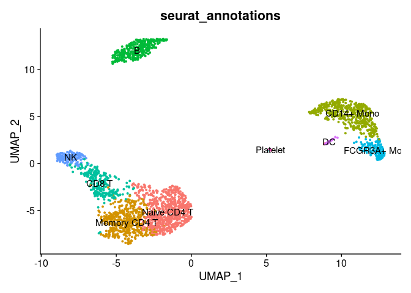
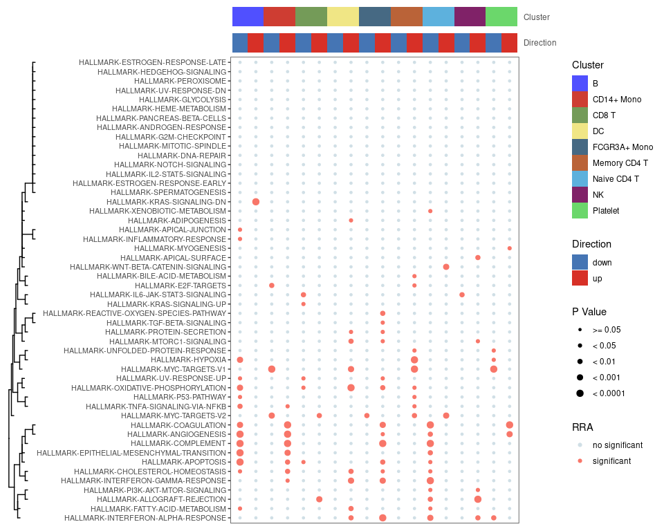

<!-- README.md is generated from README.Rmd. Please edit that file -->

# irGSEA

<!-- badges: start -->
<!-- badges: end -->

Integrate all single cell rank-based gene set enrichment analysis and
easy to visualize the results.

For more details, please view
[irGSEA](https://chuiqin.github.io/irGSEA/)

## Installation

``` r
# install packages from CRAN
cran.packages <- c("msigdbr", "dplyr", "purrr", "stringr","magrittr",
                   "RobustRankAggreg", "tibble", "reshape2", "ggsci",
                   "tidyr", "aplot", "ggfun", "ggplotify", "ggridges", 
                   "gghalves", "Seurat", "SeuratObject", "methods", 
                   "devtools", "BiocManager","data.table","doParallel",
                   "doRNG")
if (!requireNamespace(cran.packages, quietly = TRUE)) { 
    install.packages(cran.packages, ask = F, update = F)
}

# install packages from Bioconductor
bioconductor.packages <- c("GSEABase", "AUCell", "SummarizedExperiment", 
                           "singscore", "GSVA", "ComplexHeatmap", "ggtree", 
                           "Nebulosa")
if (!requireNamespace(bioconductor.packages, quietly = TRUE)) { 
    BiocManager::install(bioconductor.packages, ask = F, update = F)
}

if (!requireNamespace("UCell", quietly = TRUE)) { 
    devtools::install_github("carmonalab/UCell")
}
if (!requireNamespace("irGSEA", quietly = TRUE)) { 
    devtools::install_github("chuiqin/irGSEA")
}
```

## load example dataset

load PBMC dataset by R package SeuratData

``` r
# devtools::install_github('satijalab/seurat-data')
library(SeuratData)
# view all available datasets
View(AvailableData())
# download 3k PBMCs from 10X Genomics
InstallData("pbmc3k")
# the details of pbmc3k.final
?pbmc3k.final
```

``` r
library(Seurat)
library(SeuratData)
# loading dataset
data("pbmc3k.final")
pbmc3k.final <- UpdateSeuratObject(pbmc3k.final)
# plot
DimPlot(pbmc3k.final, reduction = "umap",
        group.by = "seurat_annotations",label = T) + NoLegend()
```


``` r
# set cluster to idents
Idents(pbmc3k.final) <- pbmc3k.final$seurat_annotations
```

## Load library

``` r
library(UCell)
library(irGSEA)
```

## Calculate enrichment scores

calculate enrichment scores, return a Seurat object including these
score matrix

AUcell or ssGSEA will run for a long time if there are lots of genes or
cells. Thus, It’s recommended to keep high quality genes or cells.

Error (Valid ‘mctype’: ‘snow’ or ‘doMC’) occurs when ncore &gt; 1 :
please ensure the version of AUCell &gt;= 1.14 or set ncore = 1.

It can be ignore when warnning occurs as follow: 1. closing unused
connection 3 (localhost) 2. Using ‘dgCMatrix’ objects as input is still
in an experimental stage. 3. xxx genes with constant expression values
throuhgout the samples. 4. Some gene sets have size one. Consider
setting ‘min.sz’ &gt; 1.

``` r
pbmc3k.final <- irGSEA.score(object = pbmc3k.final, assay = "RNA", 
                             slot = "data", seeds = 123, ncores = 1,
                             min.cells = 3, min.feature = 0,
                             custom = F, geneset = NULL, msigdb = T, 
                             species = "Homo sapiens", category = "H",  
                             subcategory = NULL, geneid = "symbol",
                             method = c("AUCell", "UCell", "singscore", 
                                        "ssgsea"),
                             aucell.MaxRank = NULL, ucell.MaxRank = NULL, 
                             kcdf = 'Gaussian')
#> Validating object structure
#> Updating object slots
#> Ensuring keys are in the proper strucutre
#> Ensuring feature names don't have underscores or pipes
#> Object representation is consistent with the most current Seurat version
#> Calculate AUCell scores
#> Finish calculate AUCell scores
#> Calculate UCell scores
#> Finish calculate UCell scores
#> Calculate singscore scores
#> Finish calculate singscore scores
#> Calculate ssgsea scores
#> Finish calculate ssgsea scores
Seurat::Assays(pbmc3k.final)
#> [1] "RNA"       "AUCell"    "UCell"     "singscore" "ssgsea"
```

## Integrate differential gene set

Wlicox test is perform to all enrichment score matrixes and gene sets
with adjusted p value &lt; 0.05 are used to integrated through RRA.
Among them, Gene sets with p value &lt; 0.05 are statistically
significant and common differential in all gene sets enrichment analysis
methods. All results are saved in a list.

``` r
result.dge <- irGSEA.integrate(object = pbmc3k.final, 
                               group.by = "seurat_annotations",
                               metadata = NULL, col.name = NULL,
                               method = c("AUCell","UCell","singscore",
                                          "ssgsea"))
#> Calculate differential gene set : AUCell
#> Calculate differential gene set : UCell
#> Calculate differential gene set : singscore
#> Calculate differential gene set : ssgsea
class(result.dge)
#> [1] "list"
```

## Visualization

### 1. Global show

### heatmap plot

Show co-upregulated or co-downregulated gene sets per cluster in RRA

``` r
irGSEA.heatmap.plot <- irGSEA.heatmap(object = result.dge, 
                                      method = "RRA",
                                      top = 50, 
                                      show.geneset = NULL)
irGSEA.heatmap.plot
```



### Bubble.plot

Show co-upregulated or co-downregulated gene sets per cluster in RRA.

If error (argument “caller\_env” is missing, with no default) occurs :
please uninstall ggtree and run
“remotes::install\_github(”YuLab-SMU/ggtree“)”.

``` r
irGSEA.bubble.plot <- irGSEA.bubble(object = result.dge, 
                                    method = "RRA", 
                                    top = 50)
irGSEA.bubble.plot
```


### upset plot

Show the intersections of significant gene sets among clusters in RRA

Don’t worry if warning happens : the condition has length &gt; 1 and
only the first element will be used. It’s ok.

``` r
irGSEA.upset.plot <- irGSEA.upset(object = result.dge, 
                                  method = "RRA")
irGSEA.upset.plot
```


### Stacked bar plot

Show the intersections of significant gene sets among clusters in all
methods

``` r
irGSEA.barplot.plot <- irGSEA.barplot(object = result.dge,
                                      method = c("AUCell", "UCell", "singscore",
                                                 "ssgsea"))
irGSEA.barplot.plot
```


### 2. local show

Show the expression and distribution of special gene sets in special
gene set enrichment analysis method

### density scatterplot

Show the expression and distribution of “HALLMARK-INFLAMMATORY-RESPONSE”
in Ucell on UMAP plot.

``` r
scatterplot <- irGSEA.density.scatterplot(object = pbmc3k.final,
                             method = "UCell",
                             show.geneset = "HALLMARK-INFLAMMATORY-RESPONSE",
                             reduction = "umap")
scatterplot
```


### half vlnplot

Show the expression and distribution of “HALLMARK-INFLAMMATORY-RESPONSE”
in Ucell among clusters.

``` r
halfvlnplot <- irGSEA.halfvlnplot(object = pbmc3k.final,
                                  method = "UCell",
                                  show.geneset = "HALLMARK-INFLAMMATORY-RESPONSE")
halfvlnplot
```



### ridge plot

Show the expression and distribution of “HALLMARK-INFLAMMATORY-RESPONSE”
in Ucell among clusters.

``` r
ridgeplot <- irGSEA.ridgeplot(object = pbmc3k.final,
                              method = "UCell",
                              show.geneset = "HALLMARK-INFLAMMATORY-RESPONSE")
ridgeplot
#> Picking joint bandwidth of 0.00533
```


### density heatmap

Show the expression and distribution of “HALLMARK-INFLAMMATORY-RESPONSE”
in Ucell among clusters.

``` r
densityheatmap <- irGSEA.densityheatmap(object = pbmc3k.final,
                                        method = "UCell",
                                        show.geneset = "HALLMARK-INFLAMMATORY-RESPONSE")
densityheatmap
```


