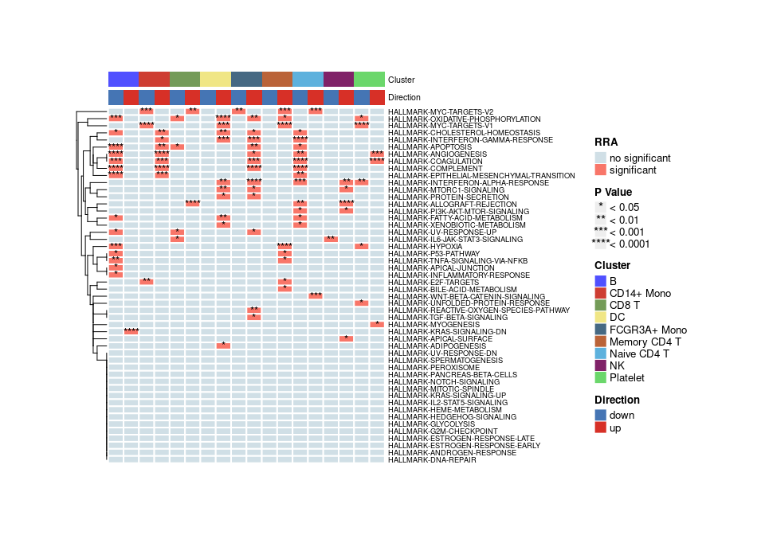
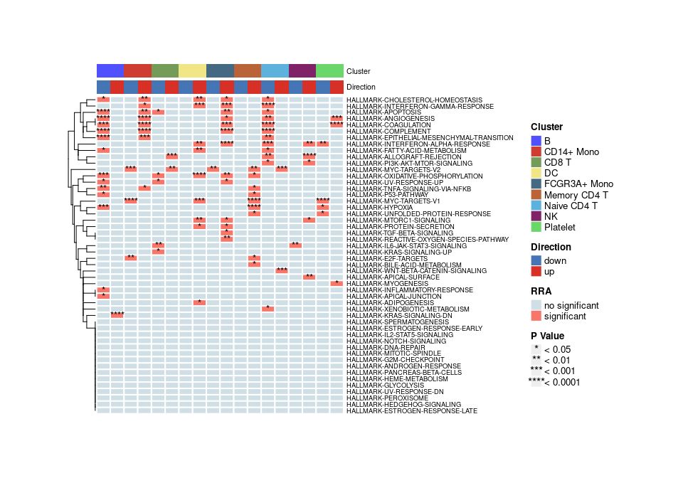
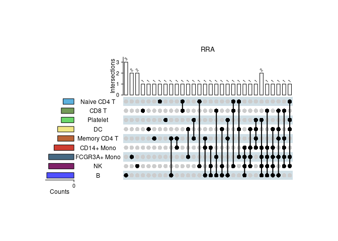

<!-- README.md is generated from README.Rmd. Please edit that file -->

# irGSEA

<!-- badges: start -->
<!-- badges: end -->

Integrate all single cell rank-based gene set enrichment analysis and
easy to visualize the results.

For more details, you can view it. [irGSEA](https://chuiqin.github.io/irGSEA/)

## Preparation

``` r
# install packages from CRAN
cran.packages <- c("msigdbr", "dplyr", "purrr", "stringr","magrittr",
                   "RobustRankAggreg", "tibble", "reshape2", "ggsci",
                   "tidyr", "aplot", "ggfun", "ggplotify", "ggridges", 
                   "gghalves", "Seurat", "SeuratObject", "methods", 
                   "devtools", "BiocManager","data.table")
if (!requireNamespace(cran.packages, quietly = TRUE)) { 
    install.packages(cran.packages, ask = F, update = F)
}

# install packages from Bioconductor
bioconductor.packages <- c("GSEABase", "AUCell", "SummarizedExperiment", 
                           "singscore", "GSVA", "ComplexHeatmap", "ggtree", 
                           "Nebulosa")
if (!requireNamespace(bioconductor.packages, quietly = TRUE)) { 
    BiocManager::install.packages(bioconductor.packages, ask = F, update = F)
}

# install packages from Github
if (!requireNamespace("UCell", quietly = TRUE)) { 
    devtools::install_github("carmonalab/UCell")
}
if (!requireNamespace("irGSEA", quietly = TRUE)) { 
    devtools::install_github("chuiqin/irGSEA")
}
```

## load example dataset

load PBMC dataset by R package SeuratData

``` r
# devtools::install_github('satijalab/seurat-data')
library(SeuratData)
# view all available datasets
View(AvailableData())
# download 3k PBMCs from 10X Genomics
InstallData("pbmc3k")
# the details of pbmc3k.final
?pbmc3k.final
```

``` r
library(Seurat)
#> Attaching SeuratObject
library(SeuratData)
#> Registered S3 method overwritten by 'cli':
#>   method     from         
#>   print.boxx spatstat.geom
#> Warning in if (is.na(desc)) {: the condition has length > 1 and only the first
#> element will be used

#> Warning in if (is.na(desc)) {: the condition has length > 1 and only the first
#> element will be used

#> Warning in if (is.na(desc)) {: the condition has length > 1 and only the first
#> element will be used

#> Warning in if (is.na(desc)) {: the condition has length > 1 and only the first
#> element will be used

#> Warning in if (is.na(desc)) {: the condition has length > 1 and only the first
#> element will be used

#> Warning in if (is.na(desc)) {: the condition has length > 1 and only the first
#> element will be used

#> Warning in if (is.na(desc)) {: the condition has length > 1 and only the first
#> element will be used

#> Warning in if (is.na(desc)) {: the condition has length > 1 and only the first
#> element will be used

#> Warning in if (is.na(desc)) {: the condition has length > 1 and only the first
#> element will be used

#> Warning in if (is.na(desc)) {: the condition has length > 1 and only the first
#> element will be used

#> Warning in if (is.na(desc)) {: the condition has length > 1 and only the first
#> element will be used

#> Warning in if (is.na(desc)) {: the condition has length > 1 and only the first
#> element will be used
#> ── Installed datasets ───────────────────────────────────── SeuratData v0.2.1 ──
#> ✓ pbmc3k 3.1.4
#> ────────────────────────────────────── Key ─────────────────────────────────────
#> ✓ Dataset loaded successfully
#> > Dataset built with a newer version of Seurat than installed
#> ❓ Unknown version of Seurat installed
# loading dataset
data("pbmc3k.final")
pbmc3k.final <- UpdateSeuratObject(pbmc3k.final)
#> Validating object structure
#> Updating object slots
#> Ensuring keys are in the proper strucutre
#> Ensuring feature names don't have underscores or pipes
#> Object representation is consistent with the most current Seurat version
# plot
DimPlot(pbmc3k.final, reduction = "umap",
        group.by = "seurat_annotations",label = T) + NoLegend()
```


``` r
# set cluster to idents
Idents(pbmc3k.final) <- pbmc3k.final$seurat_annotations
```

## Calculate enrichment scores

calculate enrichment scores, return a Seurat object including these
score matrix

``` r
library(data.table)
library(irGSEA)
library(UCell)
#> Loading required package: Matrix
Seurat::Assays(pbmc3k.final)
#> [1] "RNA"
pbmc3k.final <- irGSEA.score(object = pbmc3k.final, assay = "RNA", 
                             slot = "data", seeds = 123, ncores = 4,
                             min.cells = 3, min.feature = 0,
                             custom = F, geneset = NULL, msigdb = T, 
                             species = "Homo sapiens", category = "H",  
                             subcategory = NULL, geneid = "symbol",
                             method = c("AUCell", "UCell", "singscore", 
                                        "ssgsea"),
                             aucell.MaxRank = NULL, ucell.MaxRank = NULL, 
                             kcdf = 'Gaussian')
#> Validating object structure
#> Updating object slots
#> Ensuring keys are in the proper strucutre
#> Ensuring feature names don't have underscores or pipes
#> Object representation is consistent with the most current Seurat version
#> Calculate AUCell scores
#> Warning: Feature names cannot have underscores ('_'), replacing with dashes
#> ('-')

#> Warning: Feature names cannot have underscores ('_'), replacing with dashes
#> ('-')
#> Finish calculate AUCell scores
#> Calculate UCell scores
#> Loading required package: future.apply
#> Loading required package: future
#> Warning: Feature names cannot have underscores ('_'), replacing with dashes
#> ('-')

#> Warning: Feature names cannot have underscores ('_'), replacing with dashes
#> ('-')
#> Finish calculate UCell scores
#> Calculate singscore scores
#> Warning: Feature names cannot have underscores ('_'), replacing with dashes
#> ('-')

#> Warning: Feature names cannot have underscores ('_'), replacing with dashes
#> ('-')
#> Finish calculate singscore scores
#> Calculate ssgsea scores
#> Warning in .filterFeatures(expr, method): 1 genes with constant expression
#> values throuhgout the samples.

#> Warning in .filterFeatures(expr, method): Feature names cannot have underscores
#> ('_'), replacing with dashes ('-')

#> Warning in .filterFeatures(expr, method): Feature names cannot have underscores
#> ('_'), replacing with dashes ('-')
#> Finish calculate ssgsea scores
Seurat::Assays(pbmc3k.final)
#> [1] "RNA"       "AUCell"    "UCell"     "singscore" "ssgsea"
```

## Integrate differential gene set

Wlicox test is perform to all enrichment score matrixes and gene sets
with adjusted p value &lt; 0.05 are used to integrated through RRA.
Among them, Gene sets with p value &lt; 0.05 are statistically
significant and common differential in all gene sets enrichment analysis
methods. All results are saved in a list.

``` r
result.dge <- irGSEA.integrate(object = pbmc3k.final, 
                               group.by = "seurat_annotations",
                               metadata = NULL, col.name = NULL,
                               method = c("AUCell","UCell","singscore",
                                          "ssgsea"))
#> Calculate differential gene set : AUCell
#> Calculate differential gene set : UCell
#> Calculate differential gene set : singscore
#> Calculate differential gene set : ssgsea
#> Using Name as id variables
#> Using Name as id variables
#> Using Name as id variables
#> Using Name as id variables
#> Using Name as id variables
#> Using Name as id variables
#> Using Name as id variables
#> Using Name as id variables
#> Using Name as id variables
#> Using Name as id variables
#> Using Name as id variables
#> Using Name as id variables
#> Using Name as id variables
#> Using Name as id variables
#> Using Name as id variables
#> Using Name as id variables
#> Using Name as id variables
#> Using Name as id variables
class(result.dge)
#> [1] "list"
```

## Visualization

### 1. Global show

### heatmap plot

Show co-upregulated or co-downregulated gene sets per cluster in RRA

``` r
irGSEA.heatmap.plot <- irGSEA.heatmap(object = result.dge, 
                                      method = "RRA",
                                      top = 50, 
                                      show.geneset = NULL)
irGSEA.heatmap.plot
```


### Bubble.plot

Show co-upregulated or co-downregulated gene sets per cluster in RRA

``` r
irGSEA.bubble.plot <- irGSEA.bubble(object = result.dge, 
                                    method = "RRA", 
                                    top = 50)
irGSEA.bubble.plot
```


### upset plot

Show the intersections of significant gene sets among clusters in RRA

``` r
irGSEA.upset.plot <- irGSEA.upset(object = result.dge, 
                                  method = "RRA")
#> Warning in if (as.character(ta_call[[1]]) == "upset_top_annotation") {: the
#> condition has length > 1 and only the first element will be used
irGSEA.upset.plot
```


### Stacked bar plot

Show the intersections of significant gene sets among clusters in all
methods

``` r
irGSEA.barplot.plot <- irGSEA.barplot(object = result.dge,
                                      method = c("AUCell", "UCell", "singscore",
                                                 "ssgsea"))
irGSEA.barplot.plot
```



### 2. local show

Show the expression and distribution of special gene sets in special
gene set enrichment analysis method

### density scatterplot

Show the expression and distribution of “HALLMARK-INFLAMMATORY-RESPONSE”
in Ucell on UMAP plot.

``` r
scatterplot <- irGSEA.density.scatterplot(object = pbmc3k.final,
                             method = "UCell",
                             show.geneset = "HALLMARK-INFLAMMATORY-RESPONSE",
                             reduction = "umap")
scatterplot
```


### half vlnplot

Show the expression and distribution of “HALLMARK-INFLAMMATORY-RESPONSE”
in Ucell among clusters.

``` r
halfvlnplot <- irGSEA.halfvlnplot(object = pbmc3k.final,
                                  method = "UCell",
                                  show.geneset = "HALLMARK-INFLAMMATORY-RESPONSE")
halfvlnplot
```



### ridge plot

Show the expression and distribution of “HALLMARK-INFLAMMATORY-RESPONSE”
in Ucell among clusters.

``` r
ridgeplot <- irGSEA.ridgeplot(object = pbmc3k.final,
                              method = "UCell",
                              show.geneset = "HALLMARK-INFLAMMATORY-RESPONSE")
ridgeplot
#> Picking joint bandwidth of 0.00533
```


### density heatmap

Show the expression and distribution of “HALLMARK-INFLAMMATORY-RESPONSE”
in Ucell among clusters.

``` r
densityheatmap <- irGSEA.densityheatmap(object = pbmc3k.final,
                                        method = "UCell",
                                        show.geneset = "HALLMARK-INFLAMMATORY-RESPONSE")
densityheatmap
```


